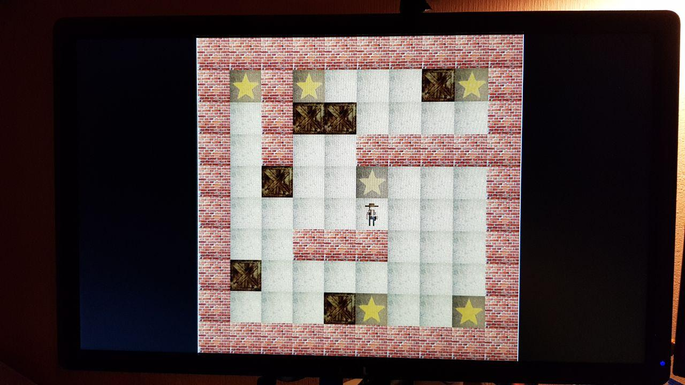

# Squares
#### Playing Sokoban with FPGA

--------------

This repository contains a DE1-SoC project created for my university's FPGA class.

It's a Verilog implementation of the game of [Sokoban](https://en.wikipedia.org/wiki/Sokoban) - along with PS2 keyboard driver implementation, and, probably more important, VGA video streamer.

### What it looks like

### About the project 
It was developed using Quartus Lite 19.1 with Platform Designer (Qsys).

The main project structure is described in Qsys' squares.qsys file. There, apart from clocks, PLLs and VGA streamer instance, is the main Game module. It's implementation can be found in [game.v](game.v). It itself consists of various modules, forming a pipeline.

#### Game processing pipeline
* As the game logic is driven by pressing keys, the first module, [keyboard_controller.v](keyboard_controller.v), is responsible for talking to the keyboard over PS2. It internally uses [keyboard_press_driver.v](keyboard_press_driver.v) module, which was not created by me, it uses (I guess) the most used implementation that can be found on the Internet. The citation for it can be found at the bottom of this file. I've tried using both my own implementation and the one proposed by Qsys, for some reason none of them was eager to talk to the keyboard I own (...I borrowed).
* Then, the [game_logic.v](game_logic.v) and [operational_memory.v](operational_memory.v) modules are the ones responsible for executing the game's logic and holding the board's state, respectively. This memory is initialized by [new_game_coordinator.v](new_game_coordinator.v), which copies the relevant part of memory storing various boards (more information in the section at the bottom). The game's logic's responsibility is handling the incoming keyboard clicks, deciding whether the move resulting from them is correct, and if yes, informing entities mover ([entities_mover.v](entities_mover.v)) of the need to process the move - namely, to keep track of the entity's/entities' move from one field to another and update their position in operational memory.
* Entities drawer ([entities_drawer.v](entities_drawer.v)) when a new game state is in the operational memory, converts it to a list of entities (along with their position), stored in another memory piece - first the immovable ones, like walls or floors (aka dirt), then the movable ones - or, to be precise, the ones currently in motion. This is done so that the entities can be further drawn on the screen in the same order they appear in memory - without being covered up later.

Next modules in the pipeline are created in a way which prevents them from introducing further delays - namely, both the mentioned memory with entities and the row storing memory (below) are a "double memory" ([double_memory.v](double_memory.v)) - a (currently) main memory and a buffer. They consist of two RAM memory modules, one of which is being read from at the moment by the next module in the pipeline, and the other one - filled be the preceding one. When a signal of reading being finished comes from the following module, the RAMs are swapped and a new read can be started without a further delay.

* Row drawer ([row_drawer.v](row_drawer.v)) prepares rows of pixels to be sent to the VGA module. My first idea here was to have a double memory holding a whole screen description and a buffer of the next one, but it turned out 640x480x24 bits is a little too much to fit in FPGA's memory, so I turned to having a double memory for rows. So the row drawer reads the list of entities, for each one calculates if it should be anywhere in the currently drawn row, and if yes, copies out the corresponding row of the entity's picture from ROM memory.
* ROM memory storing the pictures for entities is initialized with [memory.mif](memory.mif) file. It's created with Python script [generate_rom_memory.py](generate_rom_memory.py). As the board consists of squares of the same size, all pics are also like that - 48x48, times 24 bits for RGB color.
* VGA module ([vga_streamer.v](vga_streamer.v)) is an implementation of Avalon Streaming Source. The corresponding Streaming Sink is delivered via Qsys VGA Streamer module. The Source module is responsible for reading rows from the double memory module and sending them to the Sink, while also informing the preceding modules of the need to swap rows or prepare new game state and swap entities memory.

##### Apart from the main pipeline
The game is able to handle asynchronous restart requests -- and since, also supports re-loading different boards. 

Restart is initialized by pressing one of the FPGA's built-in keys. Then the board having the number specified using 3 built-in switches is loaded from another ROM memory, described in [new_game_coordinator.v](new_game_coordinator.v) and initialized with [boards_memory.mif](boards_memory.mif) file. The contents of this file are generated with [generate_op_memory.py](generate_op_memory.py) Python script. 

------------
#### Citation
The [keyboard_press_driver.v](keyboard_press_driver.v) and [keyboard_inner_driver.v](keyboard_inner_driver.v) modules were written by Dr. Hauck at the University of Washington ([class.ece.uw.edu/271/hauck2/de1/keyboard](https://class.ece.uw.edu/271/hauck2/de1/keyboard)).